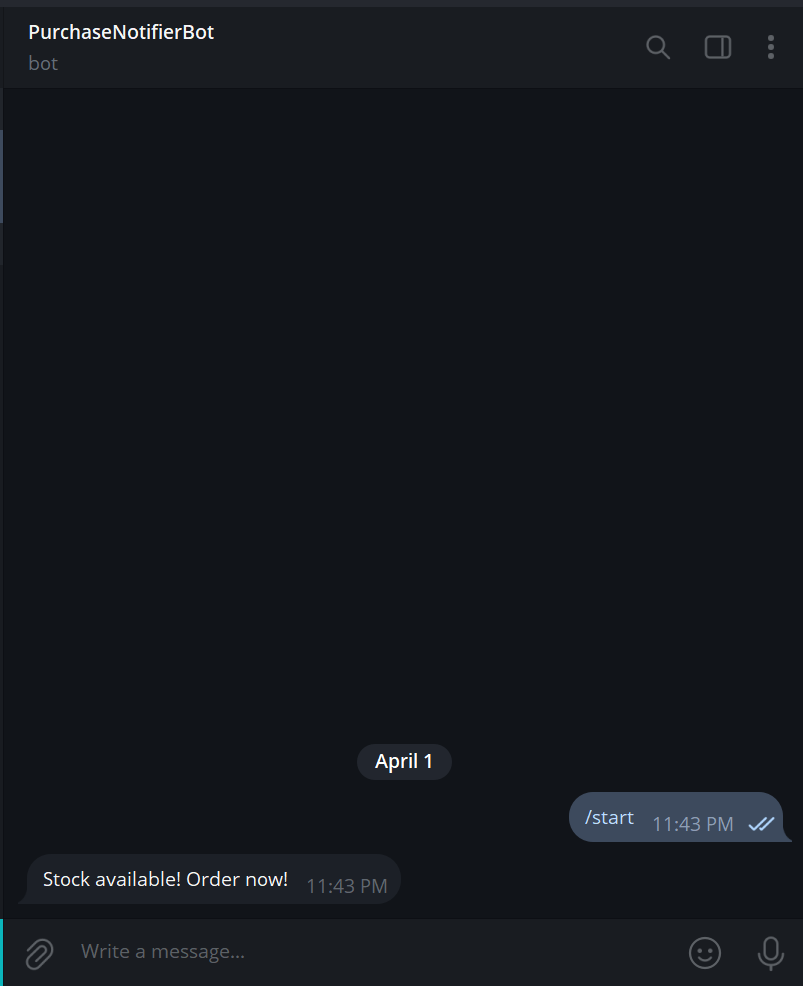

# Purchase Bot Demo
A Python-based automation bot that monitors a product page and sends Telegram alerts when stock is detected.

## Features
- Checks stock every 20 seconds
- Supports multi-account handling
- Auto-submits order (simulated)
- Telegram alert upon success
- Cross-platform (macOS compatible)

## Built With
- Python 3
- [Playwright](https://playwright.dev/python/)
- Telegram Bot API

## Screenshot


## How to Use

### 1. Install dependencies
```bash
pip install -r requirements.txt
```

### 2. Set up your Telegram Bot
- Create a bot via @BotFather
- Replace the placeholder token and chat ID in purchase_bot_demo.py

### 3. Run the bot
```bash
python purchase_bot_demo.py
```

## Note
- This is a working demo template. You can adapt it to real store URLs and actual HTML selectors.
- If you’re looking to hire for a custom bot, feel free to contact!
